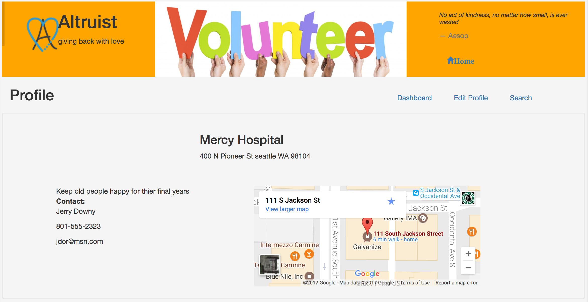

# Altruist

Altruist more than just a website, it is a gateway into volunteering.  Altruist allows both Volunteers and Nonprofits to find themselves easier and quicker than current or traditional methods.

Check it out for yourself: https://altruistic.herokuapp.com/


### Nonprofit Experience




### Volunteer Experience


Technologies used:
* Bootstrap
* EJS
* Node
* express
* google maps API
* Knex js
* PostgrSQL
* Heroku

Project Members:
* Betty Chempananical
* Donny Barclay

Installation Instructions:
Fork and clone
Run NPM Install
Create a postgresql database called
  ```
  createdb altruistic_dev
  ```
Run migration files:
  ```
  npm run knex migrate:latest
  ```
Run seed files:
  ```
  npm run knex seed:run
  ```
Start server
  ```
  npm run dev
  ```
In a browser navigate to:
  ```
  localhost:3000
  ```
